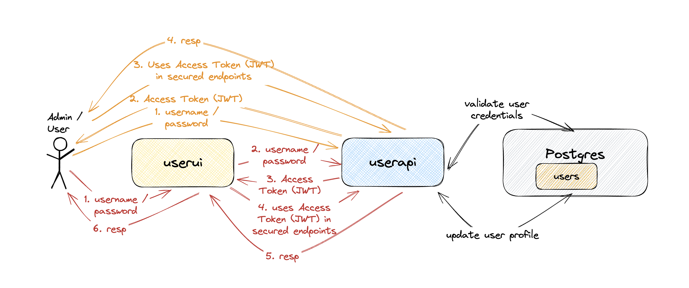

# springboot-react-jwt-token

The goal of this project is to implement an application called `user-app` to manage users. For it, we will implement a back-end [`Spring Boot`](https://docs.spring.io/spring-boot/index.html) application called `user-api` and a font-end [React](https://react.dev/) application called `user-ui`. Besides, we will use [`JWT Authentication`](https://en.wikipedia.org/wiki/JSON_Web_Token) to secure both applications.

## Proof-of-Concepts & Articles

On [ivangfr.github.io](https://ivangfr.github.io), I have compiled my Proof-of-Concepts (PoCs) and articles. You can easily search for the technology you are interested in by using the filter. Who knows, perhaps I have already implemented a PoC or written an article about what you are looking for.

## Additional Readings

- \[**Medium**\] [**Implementing A Full Stack Web App Using Spring-Boot and React**](https://medium.com/@ivangfr/implementing-a-full-stack-web-app-using-spring-boot-and-react-7db598df4452)
- \[**Medium**\] [**Implementing Social Login in a Spring Boot and React App**](https://medium.com/@ivangfr/implementing-social-login-in-a-spring-boot-and-react-app-6ce073c9983c)
- \[**Medium**\] [**Building a Web Chat with Social Login using Spring Boot: Introduction**](https://medium.com/@ivangfr/building-a-web-chat-with-social-login-using-spring-boot-introduction-644702e6be8e)
- \[**Medium**\] [**Building a Single Spring Boot App with Keycloak or Okta as IdP: Introduction**](https://medium.com/@ivangfr/building-a-single-spring-boot-app-with-keycloak-or-okta-as-idp-introduction-2814a4829aed)

## Project Diagram



## Applications

- ### user-api

  `Spring Boot` Web Java backend application that exposes a Rest API to create, retrieve and delete users. If a user has `ADMIN` role he/she can also retrieve information of other users or delete them.

  The application secured endpoints can just be accessed if a valid JWT access token is provided.

  `user-api` stores its data in [`Postgres`](https://www.postgresql.org/) database.

  #### Why Choose PostgreSQL as the Database

  In this project, we chose PostgreSQL as the database for several reasons:

  Data Consistency and Integrity: PostgreSQL provides strong data consistency and integrity guarantees, making it suitable for applications that require strict data constraints. Our project involves user management, and this data needs to maintain high consistency and integrity.

  Support for Complex Queries: PostgreSQL supports complex SQL queries and join operations, making it suitable for handling complex data relationships. Our project may require complex query operations, such as querying user details based on user information, which can be efficiently executed in PostgreSQL.

  Rich Data Types: PostgreSQL supports a variety of data types, including JSON, arrays, range types, etc., providing flexible data handling capabilities. Our project may need to store and process various types of data, such as user personal information, email, and profile pictures, which PostgreSQL can handle well.

`user-api` has the following endpoints:

| Endpoint                                                      | Secured | Roles           |
| ------------------------------------------------------------- | ------- | --------------- |
| `POST /auth/authenticate -d {"username","password"}`          | No      |                 |
| `POST /auth/signup -d {"username","password","name","email"}` | No      |                 |
| `GET /public/numberOfUsers`                                   | No      |                 |
| `GET /api/users/me`                                           | Yes     | `ADMIN`, `USER` |
| `GET /api/users`                                              | Yes     | `ADMIN`         |
| `GET /api/users/{username}`                                   | Yes     | `ADMIN`         |
| `DELETE /api/users/{username}`                                | Yes     | `ADMIN`         |
| `PUT /api/users/{username}`                                   | Yes     | `ADMIN`, `USER` |

- ### user-ui

  `React` frontend application where a user with role `USER` can create an user and retrieve a specific user. On the other hand, a user with role `ADMIN` as access to all secured endpoints.

  In user to access the application, a `user` or `admin` must login using his/her `username` and `password`. All the requests coming from `user-ui` to secured endpoints in `user-api` have the JWT access token. This token is generated when the `user` or `admin` logins.

  `user-ui` uses [`Semantic UI React`](https://react.semantic-ui.com/) as CSS-styled framework.

## Prerequisites

- [`npm`](https://docs.npmjs.com/downloading-and-installing-node-js-and-npm)
- [`Java 21+`](https://www.oracle.com/java/technologies/downloads/#java21)
- Some containerization tool [`Docker`](https://www.docker.com/), [`Podman`](https://podman.io/), etc.
- [`jq`](https://jqlang.github.io/jq/)

## Start Environment

- In a terminal, make sure you are inside the `springboot-react-jwt-token` root folder;

- Run the following command to start docker compose containers:
  ```
  docker compose up -d
  ```

## Running user-app using Maven & Npm

- **user-api**

  - Open a terminal and navigate to the `springboot-react-jwt-token/user-api` folder;

  - Run the following `Maven` command to start the application:
    ```
    ./mvnw clean spring-boot:run
    ```

- **user-ui**

  - Open another terminal and navigate to the `springboot-react-jwt-token/user-ui` folder;

  - Run the command below if you are running the application for the first time:

    ```
    npm install
    ```

  - Run the `npm` command below to start the application:

  ```
      npm start
  ```

  - Running E2E Tests

    To run the end-to-end (E2E) tests using Cypress, follow these steps:
    Install Cypress: If you haven't already installed Cypress, run the following command in your project root directory:

    ```
    npm install cypress --save-dev
    ```

    Open Cypress: Run the following command to open the Cypress Test Runner:

    ```
    npx cypress open
    ```

    Run Tests: In the Cypress Test Runner, select the test file you want to run. For example, to run the adminPage.cy.js test, navigate to cypress/e2e/admin-role-actions/adminPage.cy.js and click on it.

## Applications URLs

| Application | URL                                   | Credentials                                         |
| ----------- | ------------------------------------- | --------------------------------------------------- |
| user-api    | http://localhost:8080/swagger-ui.html |                                                     |
| user-ui     | http://localhost:3000                 | `admin/admin`, `user/user` or signing up a new user |

> **Note**: the credentials shown in the table are the ones already pre-defined. You can signup new users.

## Demo

- The video below shows a `user` loging in:

  

- The video below shows an `admin` loging in:

  

  ## Security and JWT Configuration

  ### Security Strategy

  The project uses Spring Security to implement security strategies, including authentication and authorization. Key configurations include:

  - **Authentication**: Uses `AuthenticationManager` and `UsernamePasswordAuthenticationToken` for user authentication.
  - **Authorization**: Configures access permissions for different roles, ensuring that only users with appropriate permissions can access specific endpoints.
  - **Cross-Origin Resource Sharing (CORS)**: Allows requests from `http://localhost:3000`.

  ### JWT Configuration

  The project uses JSON Web Tokens (JWT) for authentication and authorization. JWT configuration includes:

  - **Signing Key**: Uses the `HS512` algorithm and a 32-byte secret key for signing and verifying tokens.
  - **Expiration Time**: JWT expiration time is set to 10 minutes.

  ### Relevant Files

  1. **`TokenProvider` Class**: Responsible for generating and validating JWTs.
  2. **`SecurityConfig` Class**: Configures Spring Security, including the password encoder and authentication manager.
  3. **Configuration File (`application.yml`)**: Contains JWT secret and expiration time configurations.
  4. **`AuthController` Class**: Handles user login and registration requests and uses `TokenProvider` to generate JWTs.

## Util Commands

- **Postgres**

  ```
  docker exec -it postgres psql -U postgres -d orderdb
  \dt
  ```

- **jwt.io**

  With [jwt.io](https://jwt.io) you can inform the JWT token and the online tool decodes the token, showing its header and payload.

## Shutdown

- To stop `user-api` and `user-ui`, go to the terminals where they are running and press `Ctrl+C`;

- To stop and remove docker compose containers, network and volumes, go to a terminal and, inside the `springboot-react-jwt-token` root folder, run the command below:
  ```
  docker compose down -v
  ```

## How to upgrade user-ui dependencies to latest version

- In a terminal, make sure you are in the `springboot-react-jwt-token/user-ui` folder;

- Run the following commands:
  ```
  npm upgrade
  npm i -g npm-check-updates
  ncu -u
  npm install
  ```

## References

- https://www.callicoder.com/spring-boot-security-oauth2-social-login-part-2/#jwt-token-provider-authentication-filter-authentication-error-handler-and-userprincipal
- https://bezkoder.com/spring-boot-jwt-authentication/
- https://dev.to/keysh/spring-security-with-jwt-3j76
